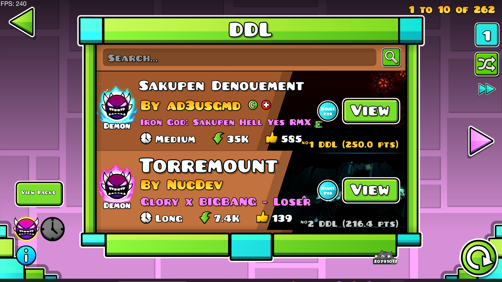
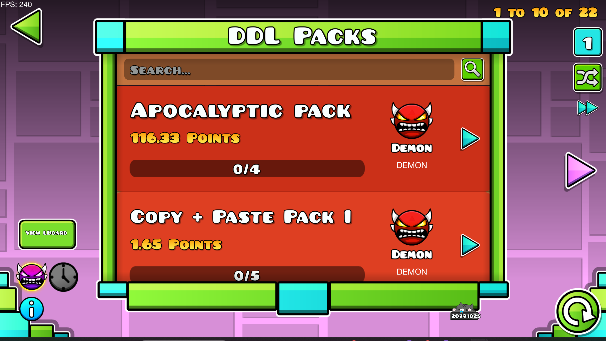
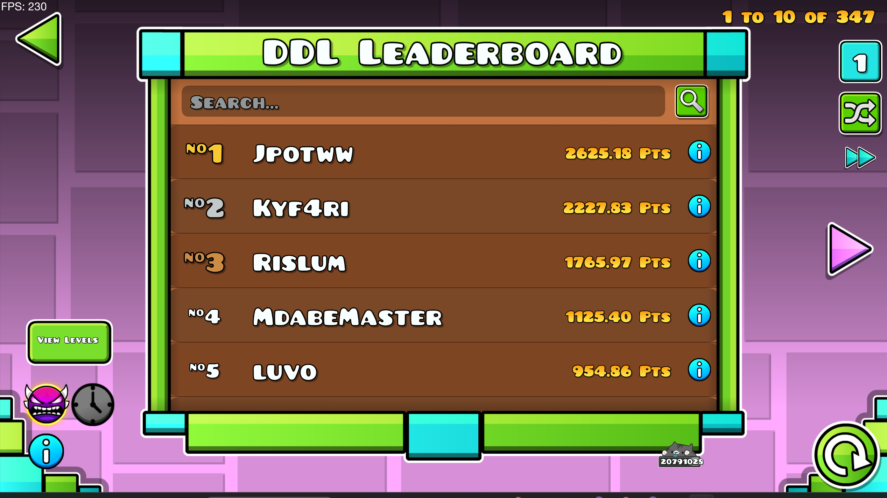
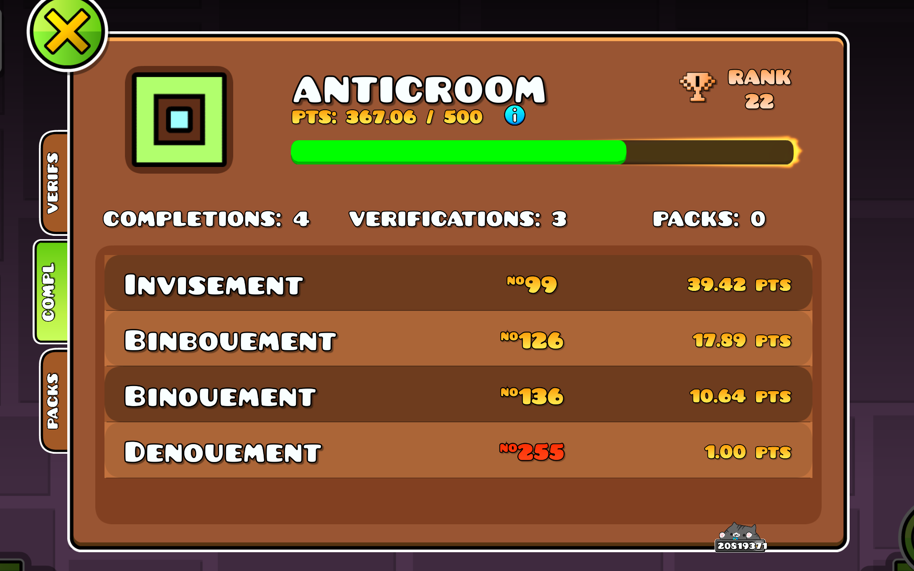

# Denouement Demon List Integration
Simple [Denouement Demon List](https://denouementdl.vercel.app/#/DDL) and [Denouement Challenge List](https://denouementdl.vercel.app/#/DCL) integration.
If you want to check our out community then come join our [Discord](https://discord.gg/denouement)! 

## Features
- A new button in the level search screen that opens the integrated lists, leaderboard, and packs.
- A search box that allows you to search for a level in the list by name.
- Navigation buttons that allow you to navigate through the lists.
- A toggle that allow you to switch between the DDL (Demon List) and the DCL (Challenge List).
- Text on a level's search box that states its position on the list (if on the list and enabled in mod settings).
- A leaderboard integrated in the mod to view player stats easily.
- Leaderboard Profiles for every user along with point milestones for cosmetic purposes.

## Credits
Huge thanks to expecially **hiimjasmine00** for allowing me to fork their mod to use as a base.

- [availax](user:1621348) - Designer of the demon icon
- [Prevter](user:7696536) - Help with shaders
- [dankmeme01](user:9735891) - Help with shaders
- [hiimjasmine00](user:7466002) - Original creator of Integrated Demonlist
- [anticroom](user:31192304) - Developer of the Denouement fork

## Gallery

If there are any issues found then just join the [Discord](https://discord.gg/denouement) and ping me in media with the issues :D

## License
This mod is licensed under the [MIT License](https://github.com/hiimjasmine00/IntegratedDemonlist/blob/master/LICENSE).
